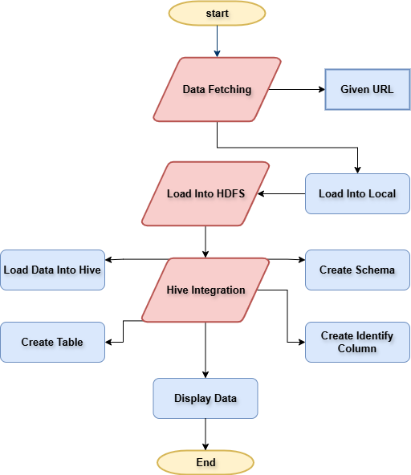

# Dynamic-Data-Ingestion-and-Storage-in-HDFS-with-Automated-Hive-Integration

## Introduction
This project fetching data from an external source, storing it in Hadoop Distributed File System (HDFS), and creating a Hive table to make the data available for analysis. The integration of Python, Shell scripting, Hadoop, and Hive enables efficient data management and reduces the need for manual intervention.

## Technologies Used

- **Python**: For scripting and automation.
- **Shell Scripting**: For executing commands and managing data flow.
- **Hadoop HDFS**: For storing large datasets.
- **Apache Hive**: For data querying and analysis.
- **wget/curl**: For downloading data from the web.

## Workflow


## Steps
1) Install hadoop and hive.
2) Make sure all the processes are running.
3) Fetch and download file from URL:
```
wget https://www2.census.gov/programs-surveys/popest/datasets/2020-2023/cities/totals/sub-est2023_10.csv
```
4) Store downloaded file in local path
    - **In my case**:  `/home/hdoop` is the local path.
      
5) Create seperate directory for file in HDFS.
    - **In my case**:  `/user/project/dataset` is the HDFS path.
      
5) Put the file in HDFS.
  ```
  hadoop fs -put /home/hdoop/sub-est2023_10.csv /user/project/dataset
  ```
6) Create database and table in Hive.
    - Use sql commands like create,delete,insert,etc.
      
7) Load file in the table.
    - *Note:* run this command in hive and rename table name.
      
  ```
      LOAD DATA INPATH /user/project/dataset/sub-est2023_10.csv INTO TABLE population_data;
  ```
8) Run sql queries and perform operation
   
**Note:** All the screenshots are uploaded,so you can refer to understand more.- [ScreenShot](images)

**To perform all tasks i created [bash](autoscript.sh) file.**

## Official Documentation:
- [Apache Hadoop](https://hadoop.apache.org/docs/current/)
- [Apache Hive](https://cwiki.apache.org/confluence/display/Hive/)
